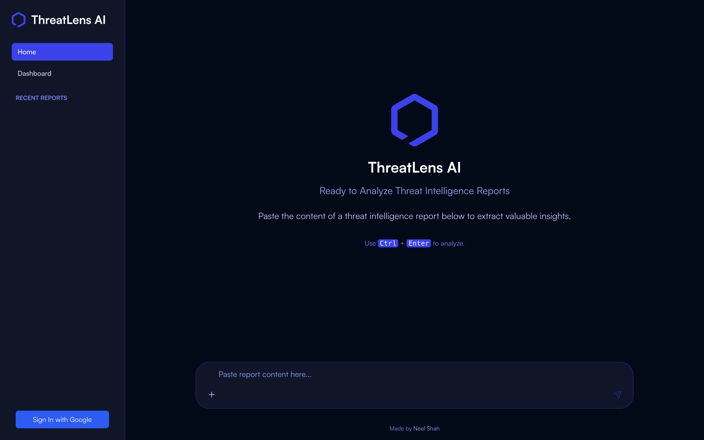

# CTI GPT

CTI GPT is a Next.js application bootstrapped with `create-next-app`. It leverages the latest Next.js App Router, automatic font optimization with the Geist font from Vercel, and comes preconfigured for rapid development and deployment.

## Demo

<!-- Include a screenshot or link to a live demo if available -->


## Features

- Built with Next.js App Router
- Automatic font optimization using `next/font` and the Geist font
- Hot reloading during development
- Zero-config TypeScript support

## Tech Stack

- Next.js
- React
- TypeScript
- Tailwind CSS (optional)
- Vercel for deployment

## Getting Started

### Prerequisites

- Node.js v14 or later
- npm or Yarn

### Installation

```bash
git clone <https://github.com/neelshha/threatlens-ai.git>
cd cti-gpt
npm install
# or
# yarn install
```

### Running Locally

```bash
npm run dev
# or
# yarn dev
```

Open [http://localhost:3000](http://localhost:3000) in your browser to see the result.

## Available Scripts

In the project directory, you can run:

```bash
npm run dev    # Start development server
npm run build  # Build for production
npm start      # Start production server
npm run lint   # Run code linter
``` 

## Folder Structure

```bash
cti-gpt/
├── app/              # Main application directory (Next.js App Router)
├── components/       # Reusable UI components
├── public/           # Static assets (images, fonts, etc.)
├── styles/           # Global and component-level styles
├── next.config.js    # Next.js configuration file
└── README.md         # Project README
```

## Environment Variables

If your project requires environment variables, create a `.env.local` in the root directory and add:

```dotenv
# Example
NEXT_PUBLIC_API_URL=https://api.example.com
```

## Deployment

This project is configured for deployment on Vercel:

1. Push your code to a Git repository (e.g., GitHub).
2. Import the repository in Vercel.
3. Set build command to `npm run build` and the output directory to `.next`.
4. Deploy and enjoy automatic previews.

For more details, see the [Next.js deployment documentation](https://nextjs.org/docs/app/building-your-application/deploying).

## Contributing

Contributions are welcome! Feel free to open issues or submit pull requests.

## License

This project is licensed under the MIT License. See the [LICENSE](LICENSE) file for details.
